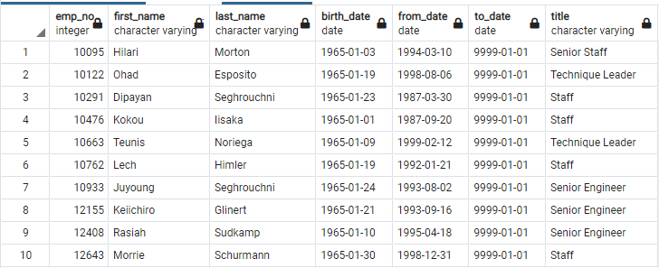
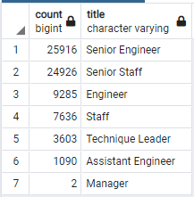

# Pewlett-Hackard-Analysis

# Overview

The purposed of this analysis was the determine the number of employees born during the years 1952, 1953, 1954, and 1955 at the technology manufacturer Pewlett-Hackard (PH). Employees born during these years would be considered eligible for retirement.

PH Employees born during the year 1965 would be eligible for a mentoring program, where they would mentor new people hired to replace the retiring employees.

# Four major points from analysis deliverables

1) There are 72,458 employees at PH born from the beginning of 1952 until the end of 1955. Here is an excerpt from the table listing all of these employees, with their current job titles:

2) These 72,458 employees have accumulated a total of 133,776 job titles. This is because many employees have had multiple job titles during their careers at PH, due to promotions and changes in their work responsibilities. For example, Summant Peac was hired as Assistant Engineer in 1985, promoted to Engineer in 1990, and then promoted to Senior Engineer in 1995 and has been working at that position for the past 27 years.

 

