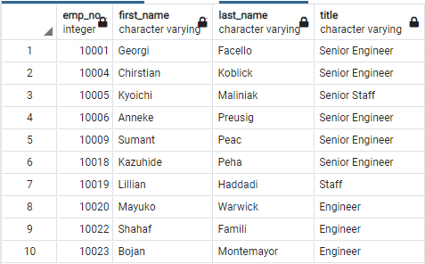

# Pewlett-Hackard-Analysis

# Overview

The purposed of this analysis was the determine the number of employees born during the years 1952, 1953, 1954, and 1955 at the technology manufacturer Pewlett-Hackard (PH). Employees born during these years would be considered eligible for retirement.

PH Employees born during the year 1965 would be eligible for a mentoring program, where they would mentor new people hired to replace the retiring employees.

# Four major points from analysis deliverables

1) There are 72,458 employees at PH born from the beginning of 1952 until the end of 1955. Here is an excerpt from the table listing all of these employees, with their current job titles:

2) These 72,458 employees have accumulated a total of 133,776 job titles. This is because many employees have had multiple job titles during their careers at PH, due to promotions and changes in their work responsibilities. For example, Sumant Peac was hired as Assistant Engineer in 1985, promoted to Engineer in 1990, and then promoted to Senior Engineer in 1995 and has been working at that position for the past 27 years.

 

3) Since most of these employees are highly experienced, over 70% of them have reached a level where they have earned "Senior" in their job title. As a reputable and renowned technology manufacturer, PH employs a high percentage of skilled technical people, so over 50% of these employees are classified as engineers. These numbers are derived from the numbers in this table:

4) Since tens of thousands of PH employees may retire soon, it is imperative that PH hire more employees. These employees need to be trained and mentored so that they will have long, successful careers at PH. Experienced employees who are not eligible to retire yet, but may become eligible within the next 10 years, are good candidates to mentor these new employees. Employees born in the year 1965 (ten years younger than employees born in 1955) will be considered for this program. The SQL analysis identifies 1,549 employees born in 1965. An excerpt from this table is below:

# Summary

Since the SQL analysis has identified 72,458 employees at PH born in the four calendar years surveyed, a time period from 67 to 70 years ago, PH is likely to lose many employees to retirement in the next few years. Over half of these roles will be in engineering and other technological positions, which are harder to fill than non-technical staff positions.

The analysis shows that there are 1,549 employees born in 1965, who could be good candidates to mentor these employees. This number is small compared to the tens of thousands of jobs that need to be filled. 

It would be a good idea to expand the mentorship eligibility to include employees born in the five years before 1965, from 1960 through 1964. There is a considerably larger number of employees born during each of these five years, compared to 1965. Changing this line of code SQL identifies the employees born from 1960 to 1964:

WHERE (de.to_date = '9999-01-01') AND (e.birth_date BETWEEN '1960-01-01' AND '1964-12-31')

The number of employees born in each of these five years is shown in this pivot table output:

This analyst also considered expanding the mentorship eligibility program to consider employees born in the five years after 1965, 1966 to 1970, using this line of code:

WHERE (de.to_date = '9999-01-01') AND (e.birth_date BETWEEN '1966-01-01' AND '1970-12-31')

However, this analysis revealed that PH has no employees born during those years. In fact, according to the data in this database, PH has no employees born after 1965. 

Thus, because PH has no employees born within the past 56 years, PH will be expected to lose a considerably high percentage of its employees due to retirement very soon. PH will be more severely impacted by upcoming retirements than most other companies, who have a greater mix of younger employees who are likely to stay around longer.
