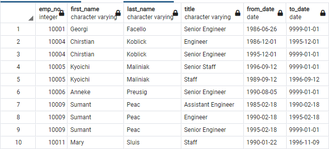

# Pewlett-Hackard-Analysis

# Overview

The purposed of this analysis was the determine the number of employees born during the years 1952, 1953, 1954, and 1955 at the technology manufacturer Pewlett-Hackard (PH). Employees born during these years would be considered eligible for retirement.

PH Employees born during the year 1965 would be eligible for a mentoring program, where they would mentor new people hired to replace the retiring employees.

# Four major points from analysis deliverables

1) There are 72,458 employees at PH born from the beginning of 1952 until the end of 1955. 

 

